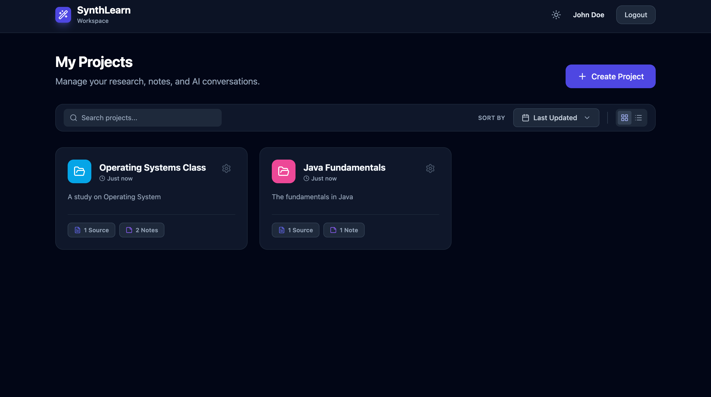
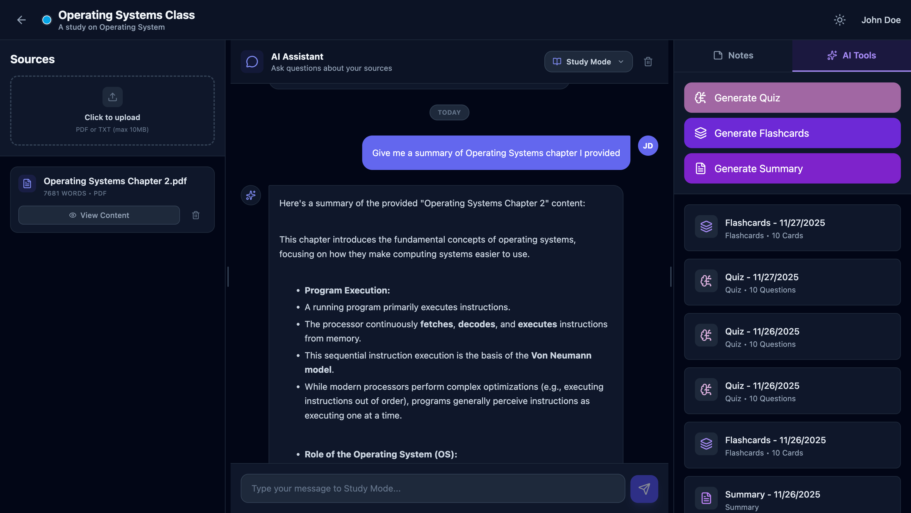
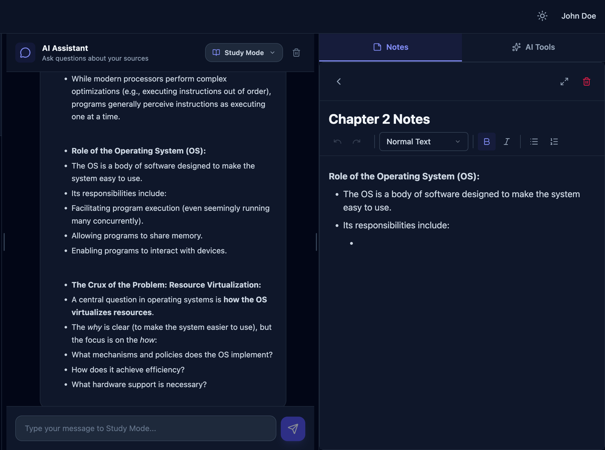
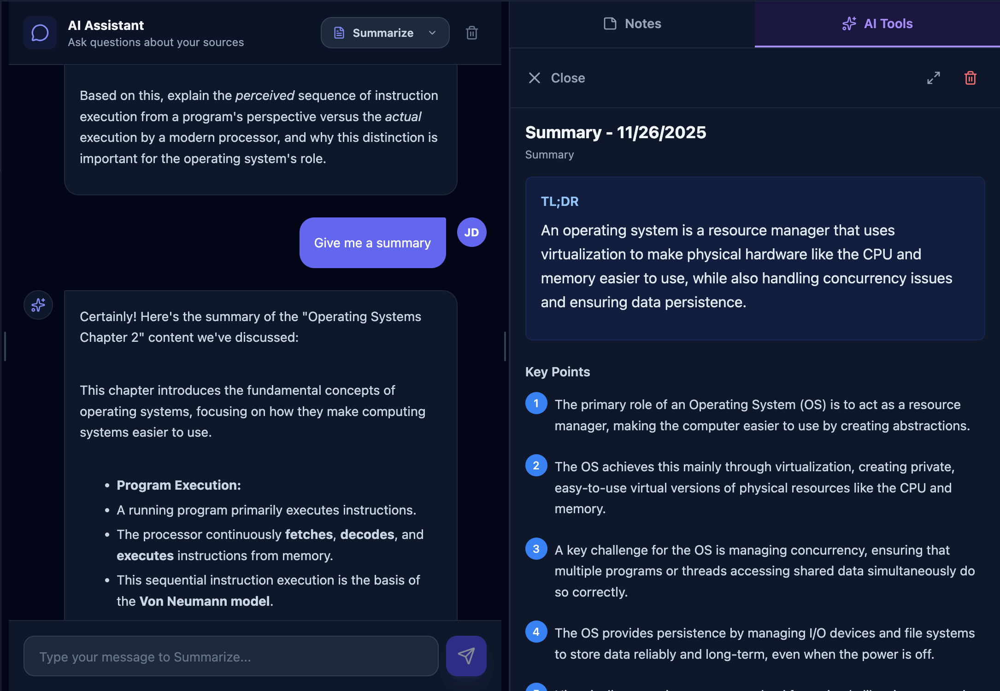
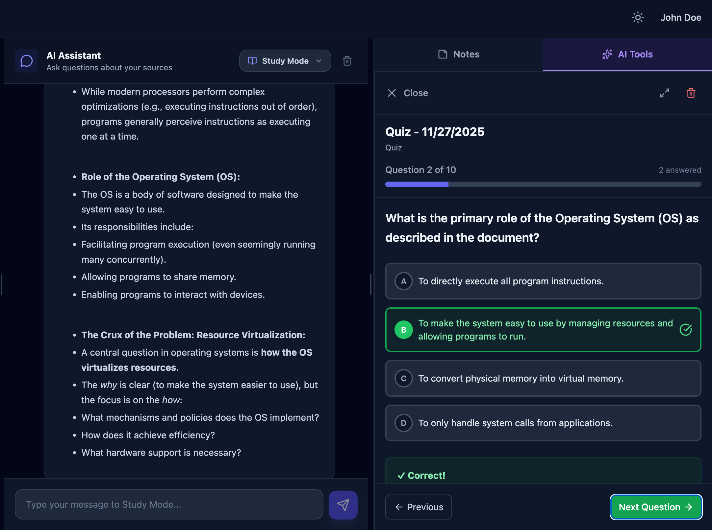
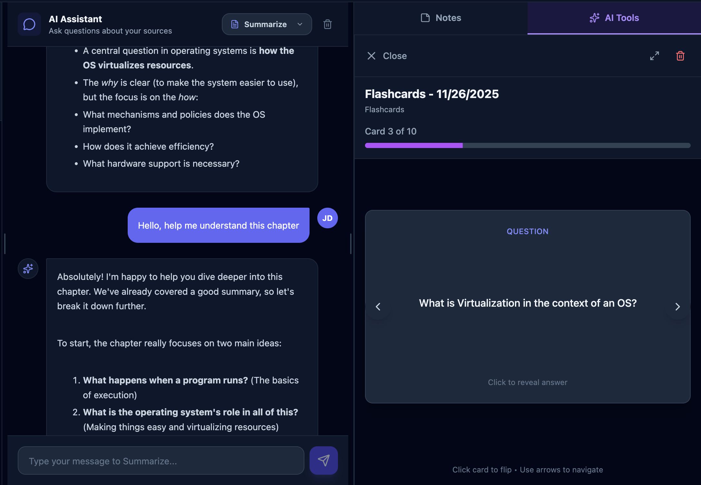

# 🧠 SynthLearn

An AI-powered study platform that utilizes a project-based learning workspace, leveraging Google's Gemini AI to transform static documents into interactive study tools. Designed to streamline the educational workflow by unifying source management, note-taking, and AI tutoring into a single, adaptive interface.

## 📸 Workspace Preview

### Dashboard


### Project Layout


### Note Editor


### Summary Generation


### Quiz Generatioin


### Flashcards Generation


## 🛠️ Tech Stack
 
### Frontend


* **Framework:** React (Vite)
* **Styling:** Tailwind CSS
* **State Management:** React Context API (Auth & Theme)
* **Editor:** TipTap (Headless WYSIWYG)
* **Layout:** React Resizable Panels
* **Icons:** Lucide React
* **HTTP Client:** Axios


### Backend


* **Runtime:** Node.js
* **Framework:** Express.js
* **Database:** PostgreSQL (via Supabase)
* **Authentication:** JWT
* **AI Integration:** Google Generative AI (Gemini Pro)
* **File Handling:** Multer
* **Parsing:** pdf-parse


### 🔐 Security


* **Authentication:** JWT (JSON Web Tokens)
* **Password Encryption:** Bcryptjs
* **Middleware:** Custom authentication & upload validation


## ✨ Features

### 📁 **Project-Based Organization**
- **Centralized Workspaces**: Organize study materials by subject or course.
- **Dynamic Filtering**: Sort projects by update time, creation date, or name.
- **Smart Search**: Real-time filtering of projects and descriptions.

### 🖥️ **Resizable Workspace Layout**
1. **Sources Panel (Left dock)**: Upload, view, and manage PDFs and text files. Includes a custom built-in document viewer with zoom and text selection.
2. **AI Chat (Center Stage)**: Context-aware chat that references your uploaded documents
   - **4 Specialized Modes**: Study Tutor, Quiz Master, Explainer, and Summarizer.
   - **Optimistic UI**: Instant message rendering for a snappy user experience.
3. **Notes & AI Tools (Right Dock)**:
   - Rich Text Editor: Powered by TipTap with formatting (bold, lists, headings).
   - AI Tools: One-click generation of Quizzes, Flashcards, and Summaries.
- Collapsible panels with icon docks

### 🤖 **AI-Powered Features**
- **Context-Aware Chat**: AI references your uploaded sources
- **Automated Content Generation**:
   - **Quiz Generation**: Multiple-choice questions with explanations and scoring
   - **Flashcard Creation**: Interactive front/back cards with 3D flip animation
   - **Smart Summaries**: TL;DR, key points, detailed notes, ELI5
- **Multiple Chat Modes**: Study tutor, quiz master, explainer, summarizer

### 🎨  **Modern UI/UX Design**

- **Dark Mode**: Fully persistent dark mode support using React Context and Tailwind.

- **Glassmorphism**: Frosted glass effects on headers and modals.

- **Responsive Docks**: Collapsible side panels with icon-only dock states for focused work.

- **Visual Feedback**: Loading skeletons, toast notifications, and hover micro-interactions.

## Setup Instructions

### Prerequisites
- Node.js (v18+)
- PostgreSQL database (or Supabase account)
- Google Gemini API key

### Installation

1. **Clone the repository**
```bash
git clone https://github.com/yourusername/ai-study-platform.git
cd ai-study-platform
```

### Backend Setup

1. Navigate to backend folder:
```bash
cd backend
```

2. Install dependencies:
```bash
npm install
```

3. Create `.env` file (use `.env.example` as template):
```bash
cp .env.example .env
```

4. Fill in your environment variables in `.env`

5. Run the server:
```bash
npm run dev
```
## Database Setup

Run the SQL commands in `backend/config/setup.sql` in your PostgreSQL database to create the necessary tables.

### Frontend Setup

1. Navigate to frontend folder:
```bash
cd frontend
```

2. Install dependencies:
```bash
npm install
```

3. Run the development server:
```bash
npm run dev
```

4. Open browser to `http://localhost:5173`

4. **Access the application**
- Frontend: `http://localhost:5173`
- Backend: `http://localhost:5001`

## 📖 Usage

1. **Register/Login** - Create an account or log in
2. **Upload Documents** - Upload PDFs or text files
3. **Generate Content**:
   - Click "Generate Summary" for AI-powered notes
   - Click "Create Quiz" for practice questions
   - Click "Make Flashcards" for spaced repetition

## 🤝 Contributing

Want to improve AI Study Platform?. Feel free to fork and modify for your own use!
Feel free to contribute! Pull requests are welcome.

## License

MIT License - See LICENSE file for details